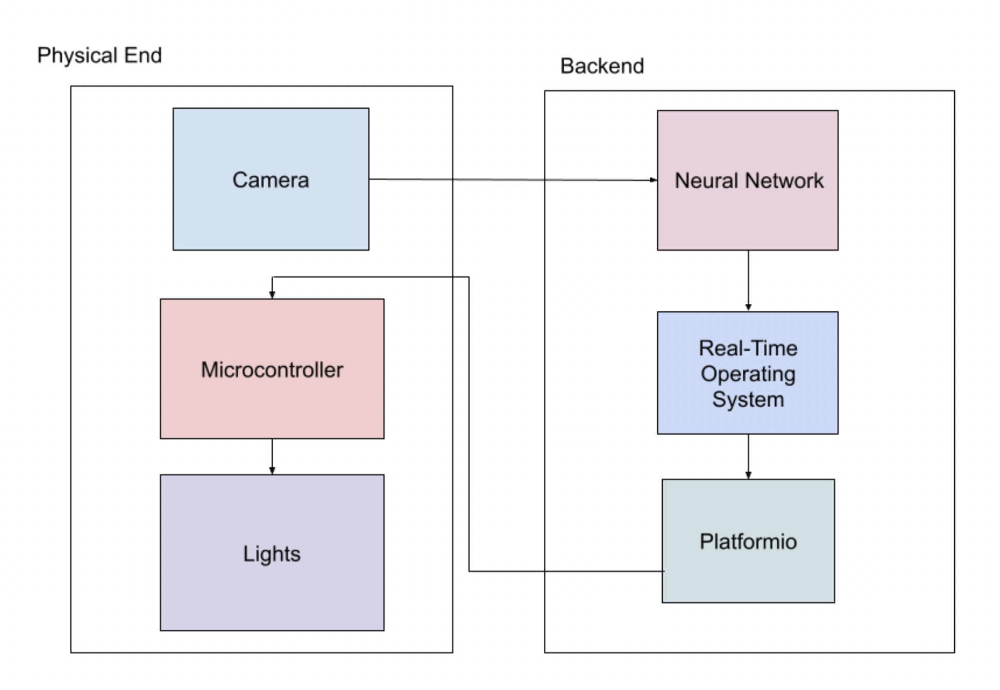

# MIND-GLOW
**MNIST Image Neural Determination - Glowing Light Optical Web**

## Purpose 
The purpose of our project is to write a neural network that trains on an MNIST dataset to identify handwritten digits and display the input, output, and hidden layer on a board of lights when reading a CSV of testing data.

## Outline
Our technical architechture consists of the neural network connected to a real-time operating system that populates a CSV file with data. We then use PlatformIO to extract and interpret the data in the CSV, which is then connected to the hardware portion of the project by being read by a microcontroller, and in turn activating lights based on the information in the input, hidden, and output layer.

The neural network was written from scratch in Python, heavily using the Numpy library for mathematical calculations and matrix operations. The light brightness code was written in C++ using the Arduino framework on a Teensy microcontroller (IMXRT MCU). 

## Installation and Setup
To install our project you have to first download our code and open it in VSCode. You then have to run multilayer.py in order to train the neural network. This will take a varied amount of time depending on what machine you're running it on. From there you have to run main.cpp in the MCU folder to set up the microcontroller to read the data correctly. 

## Task Delegation
Gautam and Ary worked on parsing the CSV and dealing with some of the hardware aspects of the project such as writing code for platformIO and building the light board. Jacob worked on writing the perceptron and multilayer neural network as well as populating the CSV with data such as weights, inputs and outputs. Elliot focused on graphing data such as errors while training and testing data as well as helping research and implement some functions within the neural network.
